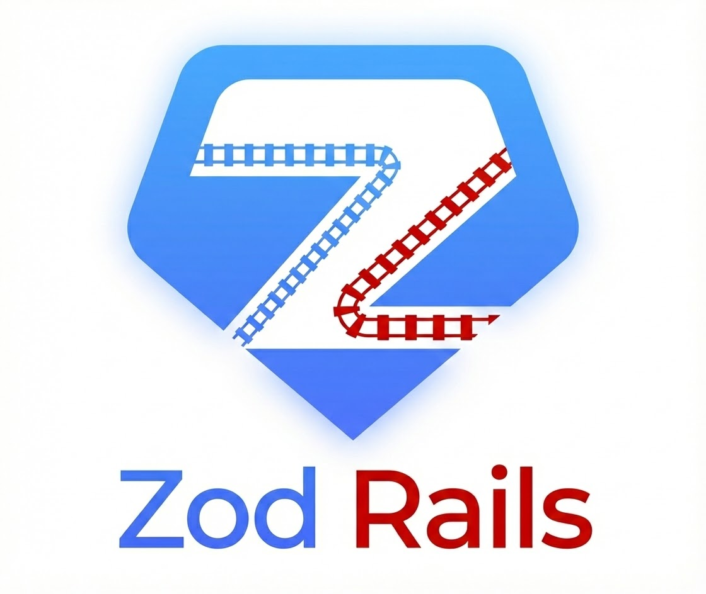

<p align="center">
  
</p>

<p align="center">
  <a href="https://github.com/mathisto/zod_rails/actions/workflows/ci.yml"></a>
  <a href="https://rubygems.org/gems/zod_rails"></a>
  <a href="https://rubygems.org/gems/zod_rails"></a>
  <a href="https://github.com/mathisto/zod_rails/blob/trunk/LICENSE"></a>
  
  
  
</p>

<p align="center">
  <strong>Generate Zod schemas from ActiveRecord models</strong><br>
  Bridge the gap between your Rails backend and TypeScript frontend with type-safe validation.
</p>

---

Generate [Zod](https://zod.dev) schemas from your ActiveRecord models. Bridge the gap between your Rails backend and TypeScript frontend with type-safe validation that stays in sync with your database schema and model validations.

## Why ZodRails?

When building Rails APIs consumed by TypeScript frontends, you often duplicate validation logic: once in your Rails models, again in your frontend forms. ZodRails eliminates this duplication by generating Zod schemas directly from your ActiveRecord models, including:

- Database column types mapped to Zod types
- Rails validations (presence, length, numericality, format) mapped to Zod constraints
- Enums generated as `z.enum()` with proper string literals
- Nullable columns and default values handled correctly
- Separate schemas for API responses vs. form inputs

## Requirements

- Ruby 3.2+
- Rails 7.0+ (uses ActiveRecord and Railtie)
- Zod 4.x in your frontend project

## Installation

Add to your Gemfile:

```ruby
gem "zod_rails"
```

Use `0.3.2` or newer. Versions `0.3.0` and `0.3.1` omitted the Railtie's Rake task file from the published gem and can
break Rails task loading.

Then run:

```bash
bundle install
```

## Quick Start

### 1. Configure the gem

Create an initializer at `config/initializers/zod_rails.rb`:

```ruby
ZodRails.configure do |config|
  config.output_dir = Rails.root.join("app/javascript/schemas").to_s
  config.models = %w[User Post Comment]
end
```

### 2. Generate schemas

```bash
bin/rails zod_rails:generate
```

### 3. Use in your frontend

```typescript
import { UserSchema, UserInputSchema, type User } from "./schemas/user";

// Validate API response
const user = UserSchema.parse(apiResponse);

// Validate form input
const formData = UserInputSchema.parse(formValues);
```

## Configuration Options

| Option | Default | Description |
|--------|---------|-------------|
| `output_dir` | `app/javascript/schemas` | Directory for generated TypeScript files |
| `models` | `[]` | Array of model names to generate schemas for |
| `schema_suffix` | `Schema` | Suffix for response schemas (e.g., `UserSchema`) |
| `input_schema_suffix` | `InputSchema` | Suffix for input schemas (e.g., `UserInputSchema`) |
| `generate_input_schemas` | `true` | Whether to generate input schemas |
| `excluded_columns` | `["id", "created_at", "updated_at"]` | Columns to exclude from input schemas |
| `post_generate_command` | `nil` | Shell command to run after a successful generation (e.g., your formatter) |

### Full Configuration Example

```ruby
ZodRails.configure do |config|
  config.output_dir = Rails.root.join("frontend/src/schemas").to_s
  config.models = %w[User Post Comment Tag]
  config.schema_suffix = "Schema"
  config.input_schema_suffix = "FormSchema"
  config.generate_input_schemas = true
  config.excluded_columns = %w[id created_at updated_at deleted_at]
end
```

## Type Mappings

| Rails/DB Type | Zod Type |
|---------------|----------|
| `string`, `text` | `z.string()` |
| `integer`, `bigint` | `z.int()` |
| `float` | `z.number()` |
| `decimal` | `z.string()` (preserves `BigDecimal` precision) |
| `boolean` | `z.boolean()` |
| `date` | `z.iso.date()` |
| `datetime`, `timestamp` | `z.iso.datetime({ offset: true })` |
| `json`, `jsonb` | `z.json()` |
| `uuid` | `z.uuid()` |
| `time` | `z.iso.datetime({ offset: true })` |
| `binary` | `z.string()` |
| `enum` | `z.enum([...])` |

PostgreSQL array columns wrap the element mapping with `z.array(...)`. Nullability and input optionality apply to the
array itself, so a nullable `string[]` becomes `z.array(z.string()).nullable()`, while a non-null array with a database
default becomes `z.array(z.string())` in the response schema and `z.array(z.string()).optional()` in the input schema.
Rails inclusion validators on array attributes constrain each element, so `inclusion: { in: %w[a b] }` produces an
element enum inside the array.

## Validation Mappings

ZodRails introspects your model validations and maps them to Zod constraints:

| Rails Validation | Zod Constraint |
|------------------|----------------|
| `presence: true` | `.min(1).refine(...)` for string/text columns, including whitespace-only rejection |
| `length: { minimum: n }` | `.min(n)` |
| `length: { maximum: n }` | `.max(n)` |
| `length: { is: n }` | `.length(n)` |
| `numericality: { greater_than: n }` | `.gt(n)` |
| `numericality: { greater_than_or_equal_to: n }` | `.gte(n)` |
| `numericality: { less_than: n }` | `.lt(n)` |
| `numericality: { less_than_or_equal_to: n }` | `.lte(n)` |
| `format: { with: /regex/ }` | `.regex(new RegExp(...))` with safe escaping and compatible flags |
| `inclusion: { in: n..m }` (Range) | `.gte(n).lte(m)`; exclusive and open-ended bounds are preserved |
| `inclusion: { in: %w[a b c] }` (Array, string column) | `z.enum(["a", "b", "c"])` as the base type |
| `inclusion: { in: [1, 5, 10] }` (Array, integer column) | `.pipe(z.union([z.literal(1), z.literal(5), z.literal(10)]))` |

### `inclusion` vs. Rails `enum`

The Rails `enum` macro and a string column with `validates :foo, inclusion: { in: %w[...] }` both end up as `z.enum([...])` in the generated TypeScript:

- `enum :role, { member: 0, admin: 1 }` introspects through ActiveRecord's `defined_enums` and emits `z.enum(["member", "admin"])`.
- `validates :decision, inclusion: { in: %w[pending approved] }` on a string column is detected by `SchemaBuilder` and restricts the result with `z.enum(["pending", "approved"])`. Other compatible validators on the attribute are retained before the enum restriction.

If you mix both (`enum` macro AND a separate `inclusion` validator on the same column), the `enum` macro wins.

## Generated Output Example

Given this Rails model:

```ruby
class User < ApplicationRecord
  enum :role, { member: 0, admin: 1, moderator: 2 }

  validates :email, presence: true, format: { with: URI::MailTo::EMAIL_REGEXP }
  validates :name, presence: true, length: { minimum: 2, maximum: 100 }
  validates :age, numericality: { greater_than: 0, less_than: 150 }, allow_nil: true
  validates :status, inclusion: { in: %w[pending active suspended] }
end
```

ZodRails generates:

```typescript
import { z } from "zod";

export const UserSchema = z.object({
  id: z.int(),
  email: z.string().min(1).refine((value) => value.trim().length > 0).regex(new RegExp("^[^@\\s]+@[^@\\s]+$")),
  name: z.string().min(2).max(100).refine((value) => value.trim().length > 0),
  age: z.int().gt(0).lt(150).nullable(),
  status: z.enum(["pending", "active", "suspended"]),
  role: z.enum(["member", "admin", "moderator"]),
  created_at: z.iso.datetime({ offset: true }),
  updated_at: z.iso.datetime({ offset: true })
});

export type User = z.infer<typeof UserSchema>;

export const UserInputSchema = z.object({
  email: z.string().min(1).refine((value) => value.trim().length > 0).regex(new RegExp("^[^@\\s]+@[^@\\s]+$")),
  name: z.string().min(2).max(100).refine((value) => value.trim().length > 0),
  age: z.int().gt(0).lt(150).nullish(),
  status: z.enum(["pending", "active", "suspended"]),
  role: z.enum(["member", "admin", "moderator"]).optional()
});

export type UserInput = z.infer<typeof UserInputSchema>;
```

## Schema vs InputSchema

ZodRails generates two schema variants:

**Schema** (e.g., `UserSchema`)
- Represents data as returned from your API
- Includes all columns (`id`, timestamps, etc.)
- Uses `.nullable()` for nullable columns

**InputSchema** (e.g., `UserInputSchema`)
- Represents data for form submission
- Excludes configured columns (defaults: `id`, `created_at`, `updated_at`)
- Uses `.optional()` for columns with database defaults
- Uses `.nullish()` for nullable columns (accepts both `null` and `undefined`)

## Preserving Hand-Written Code

The generator overwrites files in `output_dir` on every run. If you want to keep hand-written schemas, types, or imports next to the generated ones, wrap them in sentinel comments — the writer will preserve anything between the markers verbatim across regens.

Two block markers are recognized per file:

```typescript
import { z } from "zod";

// ZOD_RAILS:CUSTOM:IMPORTS:BEGIN
import { customValidator } from "./shared";
// ZOD_RAILS:CUSTOM:IMPORTS:END

export const ArticleSchema = z.object({ /* generated */ });

export type Article = z.infer<typeof ArticleSchema>;

// ZOD_RAILS:CUSTOM:BEGIN
export const ArticleResponseSchema = z.object({
  article: ArticleSchema,
  meta: z.object({ count: z.int() }),
});
// ZOD_RAILS:CUSTOM:END
```

- **Imports block** lives right after the `import { z } from "zod";` line. Use it for any external imports your custom code needs.
- **Tail block** lives at the end of the file. Use it for additional schemas, response wrappers, helper types, etc.

Both blocks are optional. If you don't add them, the file is overwritten as before. Hand-edits *outside* the markers will still be lost on regen — wrap them, or move them to a separate file.

## Drift Detection in CI

`bin/rails zod_rails:check` regenerates schemas in memory and compares them against the files on disk. Exits 0 if everything is up to date, 1 with a list of out-of-date files otherwise. Wire it into your CI to catch the case where someone updated a model but forgot to regenerate:

```yaml
- name: Check Zod schemas are up to date
  run: bin/rails zod_rails:check
```

For local iteration, `DRY_RUN=1 bin/rails zod_rails:generate` prints the same drift list without writing anything.

## Formatter Integration

If your TypeScript project runs prettier, biome, or a similar formatter with conventions that differ from the gem's output (single quotes, trailing commas, line width…), set `post_generate_command` and the gem will hand off to your formatter after a successful generation:

```ruby
ZodRails.configure do |config|
  config.post_generate_command =
    "bun run prettier --write 'app/javascript/schemas/**/*.ts'"
end
```

The command runs with your project's working directory. A nonzero exit raises `ZodRails::Error` so CI catches misconfiguration, and the generated files are still written before the formatter runs.

Because `zod_rails:check` compares generated bytes, a formatter that rewrites those bytes can report drift. Prefer a formatter configuration that accepts the generated style, or run the same deterministic formatter before checking committed files.

## Integrating with Forms

ZodRails pairs well with form libraries that support Zod:

### React Hook Form

```typescript
import { useForm } from "react-hook-form";
import { zodResolver } from "@hookform/resolvers/zod";
import { UserInputSchema, type UserInput } from "./schemas/user";

function UserForm() {
  const { register, handleSubmit, formState: { errors } } = useForm<UserInput>({
    resolver: zodResolver(UserInputSchema)
  });

  const onSubmit = (data: UserInput) => {
    // data is fully typed and validated
  };

  return <form onSubmit={handleSubmit(onSubmit)}>...</form>;
}
```

### Validating API Responses

```typescript
import { UserSchema, type User } from "./schemas/user";

async function fetchUser(id: number): Promise<User> {
  const response = await fetch(`/api/users/${id}`);
  const data = await response.json();
  return UserSchema.parse(data); // Throws if invalid
}
```

## CI/CD Integration

Use `zod_rails:check` to catch missed regenerations:

```yaml
# .github/workflows/ci.yml
- name: Check Zod schemas are up to date
  run: bin/rails zod_rails:check
```

This works whether or not the generated schemas are committed to the same repo. If they are committed, the older `git diff --exit-code` approach also works:

```yaml
- name: Generate Zod schemas
  run: bin/rails zod_rails:generate

- name: Check for uncommitted schema changes
  run: git diff --exit-code app/javascript/schemas/
```

## Troubleshooting

### Schemas not updating after model changes

Re-run the generator after any model changes:

```bash
bin/rails zod_rails:generate
```

### Validation constraints not appearing

Ensure validations are defined on the model class, not in concerns that might not be loaded. Conditional validations (`:if`, `:unless`) are detected and excluded by default.

### Custom column types

For custom types not in the mapping table, ZodRails falls back to `z.unknown()`. Open an issue if you need support for additional types.

### Serialization and validation limits

ZodRails generates a useful static approximation of database columns and unconditional model validations. It cannot reproduce validations that require database access, another attribute, or runtime model state. Conditional and context-specific validations, dynamic numericality values, uniqueness, and unsupported Ruby regular-expression modes are skipped.

The generated wire types must match your serializers. Rails emits integer and bigint attributes as JSON numbers, so
ZodRails maps both to `z.int()`. Zod intentionally rejects integers outside JavaScript's safe integer range; serialize
large identifiers as strings and provide an application-owned schema when values can exceed that range. Decimal values
map to strings to preserve `BigDecimal` precision. Review generated schemas when using custom serializers,
adapter-specific types, or custom ActiveRecord types.

PostgreSQL permits null elements and multidimensional values without exposing either constraint through ordinary
column metadata. ZodRails currently generates one-dimensional arrays with non-null elements. Use an application-owned
schema when a column intentionally stores null elements or nested arrays.

### Misconfigured model names

A typo in `config.models` no longer raises an `uninitialized constant` backtrace. The generator collects every unresolvable name and prints them all in one report:

```
ZodRails: 2 model(s) in config.models could not be loaded:
  - Useer
  - Postt

Check the model names in config/initializers/zod_rails.rb.
```

### Namespaced models

A model like `Admin::User` writes to `admin/user.ts` and exports `AdminUserSchema` / `AdminUser` (the namespace separator is collapsed for the TypeScript identifier — `::` is not valid in a TS identifier).

## Releasing

1. Bump the version in `lib/zod_rails/version.rb`
2. Commit: `git commit -am 'Bump version to x.y.z'`
3. Tag: `git tag v<x.y.z>`
4. Push with tags: `git push origin trunk --tags`

The `v*` tag push triggers the [release workflow](.github/workflows/release.yml), which runs CI and publishes to RubyGems via Trusted Publishing.

## Development

After checking out the repo:

```bash
bundle install
bundle exec rspec
bun install --frozen-lockfile
bun run test:contracts
```

The Bun contract test generates a TypeScript schema and parses representative Rails payload values with the pinned Zod
version. This complements the Ruby unit and golden tests by exercising the generated code at runtime.

## Contributing

1. Fork it
2. Create your feature branch (`git checkout -b feature/my-feature`)
3. Commit your changes (`git commit -am 'Add my feature'`)
4. Push to the branch (`git push origin feature/my-feature`)
5. Create a Pull Request

## License

MIT License. See [LICENSE](LICENSE) for details.
